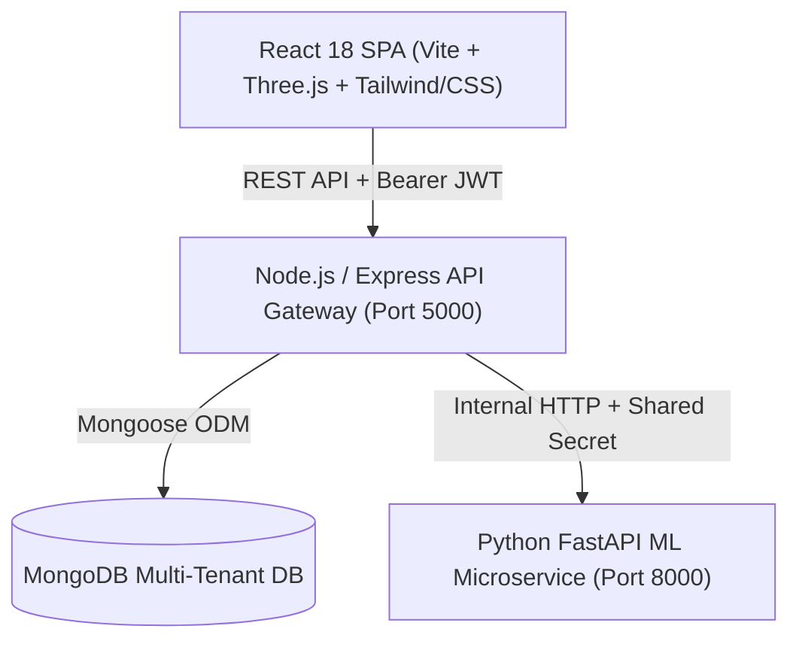

# SentiTicket 🛡️⚡
> **Enterprise Support Ticketing Platform with AI-Powered SLA Breach Prediction, Multi-Tenant RBAC & Automated Security Monitoring**

[](https://react.dev/)
[](https://nodejs.org/)
[](https://expressjs.com/)
[](https://fastapi.tiangolo.com/)
[](https://www.mongodb.com/)
[](https://www.docker.com/)

---

## 🌟 Key Features

- **🤖 AI-Powered SLA Breach Prediction**: Python FastAPI microservice trained with Scikit-learn to proactively score ticket breach risks based on team workload, ticket complexity, and historical response times.
- **🔐 Multi-Tenant Architecture & RBAC**: Strict tenant isolation across 4 distinct user roles:
  - **Admin**: Full organization management, audit trails, security logs, and SLA policy configurations.
  - **Manager**: Team workload distribution, SLA escalation monitor, and analytics dashboard.
  - **Agent**: Interactive triage queue, SLA risk board, rich ticket workspace, and internal notes.
  - **Customer**: Clean self-service ticket portal, real-time status updates, and discussion thread.
- **⏱️ Authoritative SLA Engine**: Precise business hours deadline calculation, real-time countdown widgets, automated SLA breach detection daemon, and escalation triggers.
- **🛡️ Enterprise Security**:
  - Argon2id password hashing & AES-256-GCM encrypted TOTP MFA.
  - Short-lived JWT access tokens with rotating refresh tokens and family reuse detection.
  - Strict Content Security Policy (CSP), CORS, and tiered rate limiting.
  - Tamper-evident, immutable audit logging and suspicious security event tracking.
- **🎨 Modern User Experience**: Built with React 18, Vite, Three.js 3D hero sentinel, Framer Motion transitions, and dark mode design system.

---

## 🏗️ Architecture



---

## 🚀 Quick Start (Docker Compose)

The easiest way to run the full stack locally is with Docker Compose:

```bash
# 1. Clone the repository
git clone https://github.com/ChethanKumarB-tech/SentiTicket.git
cd SentiTicket

# 2. Copy environment template
cp .env.example .env

# 3. Start all services (Client, Server, ML Service, MongoDB)
docker compose up --build
```

Access the services:
- **Client Web Application**: [http://localhost:5173](http://localhost:5173)
- **Node.js API Gateway**: [http://localhost:5000/api/v1](http://localhost:5000/api/v1)
- **FastAPI ML Microservice**: [http://localhost:8000/docs](http://localhost:8000/docs)

---

## 🛠️ Manual Development Setup

### 1. Prerequisites
- Node.js >= 20.x
- Python >= 3.11
- MongoDB >= 7.x

### 2. ML Service Setup
```bash
cd ml-service
python -m venv venv
# On Windows:
venv\Scripts\activate
# On Linux/macOS:
source venv/bin/activate

pip install -r requirements.txt
python -m app.main
```

### 3. Server Setup
```bash
cd server
npm install
npm run dev
```

### 4. Client Setup
```bash
cd client
npm install
npm run dev
```

---

## 🔒 Security Best Practices

- All authentication secrets and database connection strings must be configured via environment variables.
- Production deployments should enable TLS/SSL termination and enforce HTTPS.
- File attachments are validated against mime-type magic bytes and stored outside the web root.

---

## 📄 License

Proprietary & Confidential - All Rights Reserved.
